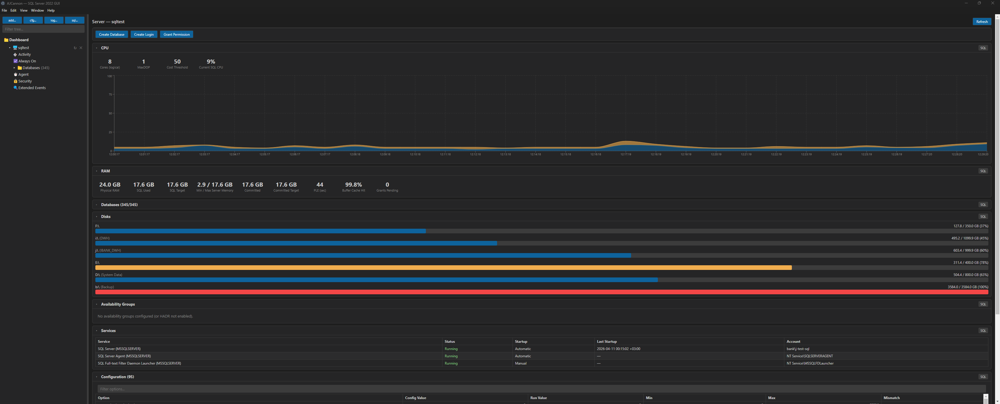

# AJCannon

**SQL Server Management GUI** — lightweight Electron desktop application for monitoring, managing, and exploring Microsoft SQL Server instances.

Named after [Annie Jump Cannon](https://en.wikipedia.org/wiki/Annie_Jump_Cannon), the astronomer who developed the stellar classification system — just as she organized stars, AJCannon helps you organize and monitor your SQL Server infrastructure.



---

## 🇺🇸 English

### Features

- **Multi-Server Dashboard** — connect to multiple SQL Server instances and monitor them from a single window with real-time CPU, sessions, and blocking indicators
- **Object Explorer** — tree-based navigation through databases, tables, views, stored procedures, functions, synonyms, triggers, indexes, user-defined types, and more
- **Current Activity Monitor** — real-time session monitoring with sorting by CPU, reads, writes, wait time; blocking chain analysis; running queries with execution plans
- **CPU & RAM Monitoring** — CPU usage charts over time, CPU by database, RAM overview with buffer pool analysis, page life expectancy
- **Disk Space Analysis** — multi-level drill-down from volumes → databases → files → objects, with pie and bar charts
- **SQL Agent Management** — view all jobs, start/stop jobs, enable/disable, view job steps, monitor currently executing jobs
- **Query Store** — track regressed queries, resource-intensive queries, and forced plans
- **Wait Statistics** — analyze server wait types and durations
- **Expensive Queries** — find the most resource-intensive queries with execution count, CPU time, reads/writes
- **Always On Availability Groups** — monitor replication status and synchronization health
- **Server Configuration** — view and monitor sp_configure settings, service accounts, startup parameters
- **Database Management** — view database states, filegroups, partition functions/schemas, backups
- **SQL Query Library** — built-in collection of 40+ diagnostic SQL queries with syntax highlighting
- **Extended Events** — monitor and analyze extended events

### Installation

#### Prerequisites

- **Node.js** 18+ and **npm**
- **Microsoft SQL Server** 2016+ (optimized for SQL Server 2022)
- **Windows** (required for `msnodesqlv8` native driver — Windows Authentication)

#### Steps

```bash
# Clone the repository
git clone https://github.com/sql-monk/AJCannon.git
cd AJCannon

# Install dependencies
npm install

# Build and run
npm start
```

### Usage

#### Development Mode

```bash
# Run in development mode with hot reload
npm run dev
```

This starts:
- TypeScript compiler in watch mode for the main process
- Webpack dev server for the renderer process
- Electron with DevTools enabled

#### Production Build

```bash
# Full production build
npm run build

# Run the built application
npx electron .
```

### Tech Stack

| Technology | Purpose |
|---|---|
| Electron 33 | Desktop application framework |
| React 18 | UI components |
| TypeScript | Type-safe code |
| mssql + msnodesqlv8 | SQL Server connectivity (Windows Auth) |
| Recharts | Data visualization (charts) |
| highlight.js | SQL syntax highlighting |
| Webpack 5 | Module bundling |

---

## 🇺🇦 Українська

### Можливості

- **Панель моніторингу кількох серверів** — підключення до кількох екземплярів SQL Server та моніторинг з одного вікна з показниками CPU, сесій та блокувань у реальному часі
- **Object Explorer** — деревоподібна навігація по базах даних, таблицях, представленнях, збережених процедурах, функціях, синонімах, тригерах, індексах, користувацьких типах тощо
- **Монітор поточної активності** — моніторинг сесій у реальному часі з сортуванням за CPU, читаннями, записами, часом очікування; аналіз ланцюгів блокувань; запити що виконуються з планами виконання
- **Моніторинг CPU та RAM** — графіки використання CPU у часі, CPU по базах даних, огляд RAM з аналізом буферного пулу, page life expectancy
- **Аналіз дискового простору** — багаторівневе занурення від томів → бази даних → файли → об'єкти, з кільцевими та стовпчиковими діаграмами
- **Керування SQL Agent** — перегляд усіх завдань, запуск/зупинка, увімкнення/вимкнення, перегляд кроків завдань, моніторинг поточного виконання
- **Query Store** — відстеження регресійних запитів, ресурсоємних запитів та примусових планів
- **Статистика очікувань** — аналіз типів очікувань сервера та їх тривалості
- **Ресурсоємні запити** — пошук найбільш витратних запитів із кількістю виконань, часом CPU, читаннями/записами
- **Always On Availability Groups** — моніторинг стану реплікації та синхронізації
- **Конфігурація сервера** — перегляд налаштувань sp_configure, облікових записів служб, параметрів запуску
- **Керування базами даних** — стан баз даних, файлові групи, функції/схеми розділення, резервні копії
- **Бібліотека SQL-запитів** — вбудована колекція з 40+ діагностичних SQL-запитів із підсвіткою синтаксису
- **Extended Events** — моніторинг та аналіз розширених подій

### Встановлення

#### Передумови

- **Node.js** 18+ та **npm**
- **Microsoft SQL Server** 2016+ (оптимізовано для SQL Server 2022)
- **Windows** (необхідно для драйвера `msnodesqlv8` — Windows Authentication)

#### Кроки

```bash
# Клонувати репозиторій
git clone https://github.com/sql-monk/AJCannon.git
cd AJCannon

# Встановити залежності
npm install

# Зібрати та запустити
npm start
```

### Використання

#### Режим розробки

```bash
# Запуск у режимі розробки з гарячим перезавантаженням
npm run dev
```

Це запускає:
- Компілятор TypeScript у режимі спостереження для основного процесу
- Webpack dev server для процесу рендерера
- Electron з увімкненими DevTools

#### Продакшн-збірка

```bash
# Повна продакшн-збірка
npm run build

# Запуск зібраного додатку
npx electron .
```

---

## Contributing / Участь у розробці

Contributions are welcome! Feel free to open issues and pull requests.

Внески вітаються! Не соромтеся відкривати issues та pull requests.

1. Fork the repository / Зробіть форк репозиторію
2. Create a feature branch / Створіть гілку для нової функції (`git checkout -b feature/amazing-feature`)
3. Commit your changes / Закомітьте зміни (`git commit -m 'Add amazing feature'`)
4. Push to the branch / Відправте в гілку (`git push origin feature/amazing-feature`)
5. Open a Pull Request / Відкрийте Pull Request

## License / Ліцензія

This project is licensed under the **GNU General Public License v3.0** — see the [LICENSE](LICENSE) file for details.

Цей проєкт ліцензовано за **GNU General Public License v3.0** — див. файл [LICENSE](LICENSE) для деталей.
Український переклад ліцензії: [UA-LICENSE](UA-LICENSE).

---

## Links / Посилання

- 🌟 [Annie Jump Cannon — Wikipedia](https://en.wikipedia.org/wiki/Annie_Jump_Cannon) — the astronomer who developed the Harvard spectral classification system
- 🌟 [Енні Джамп Кеннон — Вікіпедія](https://uk.wikipedia.org/wiki/%D0%95%D0%BD%D0%BD%D1%96_%D0%94%D0%B6%D0%B0%D0%BC%D0%BF_%D0%9A%D0%B5%D0%BD%D0%BD%D0%BE%D0%BD) — астроном, яка розробила Гарвардську спектральну класифікацію
- ⭐ [Stellar classification — Wikipedia](https://en.wikipedia.org/wiki/Stellar_classification) — the classification of stars based on spectral characteristics
- ⭐ [Спектральна класифікація зірок — Вікіпедія](https://uk.wikipedia.org/wiki/%D0%A1%D0%BF%D0%B5%D0%BA%D1%82%D1%80%D0%B0%D0%BB%D1%8C%D0%BD%D0%B0_%D0%BA%D0%BB%D0%B0%D1%81%D0%B8%D1%84%D1%96%D0%BA%D0%B0%D1%86%D1%96%D1%8F_%D0%B7%D1%96%D1%80%D0%BE%D0%BA) — класифікація зірок за спектральними характеристиками
